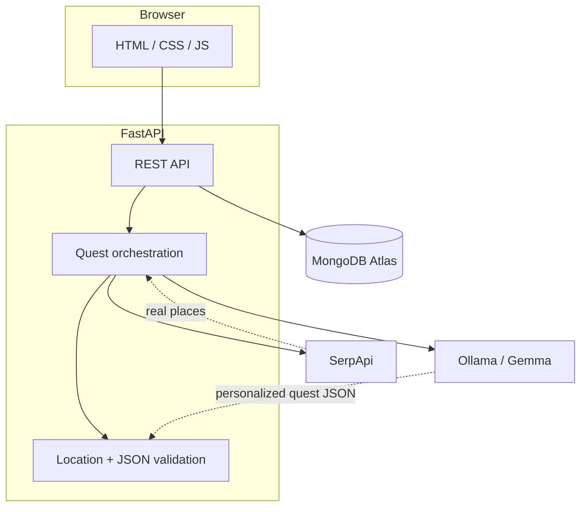

# TrailQuest AI

**Hacktoberfest 2026 — Week 1 · Theme: Touch Grass**

TrailQuest AI turns a few preferences into one real-world outdoor quest. SerpApi finds actual places near you; an open-weight model (Gemma 3 4B via Ollama) personalizes the quest from those results only. You go outside, then come back to log how it went—without turning the app into another endless feed.

Tagline: **Less scrolling. More exploring.**

---

## Problem

Many people want to spend more time outdoors but default to screens. Generic activity lists do not match local places, time, or interests.

## Solution

TrailQuest AI accepts location, available time, activity, difficulty, and optional interests. The backend searches for real outdoor locations, sends them to Gemma for one structured quest, validates that the chosen place came from the search results, saves the quest (MongoDB Atlas or in-memory fallback), and lets you record completion with an optional reflection.

---

## Features

- Real outdoor location discovery via SerpApi (Google Maps engine)
- Quest personalization with Gemma 3 4B through Ollama (configurable model)
- Strict location validation—quests cannot use invented parks or trails
- Quest storage with preferences, selected place, objectives, and timestamps (UTC)
- Completion tracking: `completed`, `partially_completed`, `not_completed`
- Vanilla HTML/CSS/JS frontend served by FastAPI
- Pytest suite with mocked external services

---

## Technology stack

| Layer | Tools |
| --- | --- |
| Frontend | HTML, CSS, JavaScript |
| Backend | Python, FastAPI, Pydantic, Uvicorn |
| Open-weight AI | Gemma 3 4B via [Ollama](https://ollama.com/) |
| Locations | [SerpApi](https://serpapi.com/) |
| Database | MongoDB Atlas (Motor), in-memory fallback |
| Version control | Git, GitHub |

---

## Architecture



---

## User flow

1. Open the app and enter preferences.
2. Backend fetches up to five real nearby outdoor places.
3. Gemma generates one quest JSON from those places only.
4. Python validates JSON, objectives (3–5), and location match.
5. Quest is saved and shown briefly—then you go outside.
6. Return to log completion and optional reflection.

---

## Why open-weight AI matters (for this project)

- **Local inference:** With Ollama, quest generation can run on your machine instead of a closed commercial chat API.
- **Inspectability:** Prompts and orchestration live in this repository; you can change them within the model license terms.
- **Model choice:** Set `OLLAMA_MODEL` to another compatible open-weight model if it follows the same JSON contract.
- **Honest limits:** SerpApi still needs the internet for location search. MongoDB Atlas stores quests when configured. Local inference keeps Ollama-bound prompts on your device during generation—it does not make the entire app offline.

Gemma is an **open-weight model** with its own license; it is not public-domain software.

---

## How the pieces work together

1. **SerpApi** — Queries Google Maps for parks, gardens, trails, and similar places near the user’s location. Names, addresses, ratings, and types are passed to the model; missing fields are not fabricated.
2. **Ollama + Gemma** — Receives preferences and the location list, returns one JSON quest. The app validates structure and enforces location match in code.
3. **MongoDB** — Persists quests and completion data when `MONGODB_URI` is set; otherwise an in-memory store is used for local development.

---

## Project structure

```
TrailQuestAI/
├── backend/app/
│   ├── config.py
│   ├── main.py
│   ├── database/mongodb.py
│   ├── models/quest.py
│   └── services/
│       ├── gemma_service.py
│       ├── serpapi_service.py
│       ├── quest_service.py
│       └── quest_repository.py
├── frontend/
│   ├── index.html
│   ├── style.css
│   └── script.js
├── tests/
│   ├── test_api.py
│   └── test_quest_service.py
├── .env.example
├── requirements.txt
├── render.yaml
├── SUBMISSION.md
├── PROJECT_CONTEXT.md
└── TRAILQUEST_MVP_REQUIREMENTS.md
```

---

## Installation (Windows / PowerShell)

### Prerequisites

- Python 3.10+
- [Ollama](https://ollama.com/) installed
- SerpApi API key
- (Optional) MongoDB Atlas connection string

### Steps

1. **Clone and enter the repo**

   ```powershell
   git clone https://github.com/mallavarapusudhishna/TrailQuest-AI.git
   cd TrailQuest-AI
   ```

2. **Virtual environment**

   ```powershell
   python -m venv .venv
   .\.venv\Scripts\Activate.ps1
   pip install -r requirements.txt
   ```

3. **Environment variables**

   Copy `.env.example` to `.env` and fill in values:

   | Variable | Required | Description |
   | --- | --- | --- |
   | `SERPAPI_API_KEY` | Yes | SerpApi key for location search |
| `MONGODB_URI` | No | MongoDB Atlas URI; omit to use in-memory storage |
| `MONGODB_DB_NAME` | No | Database name (default `trailquest_db`) |

Check storage mode anytime: `GET /health` returns a `storage` object (`mode`, `durable`, `message`). The home page shows the same message in a banner when the server is running.
   | `OLLAMA_URL` | No | Default `http://127.0.0.1:11434/api/generate` |
   | `OLLAMA_MODEL` | No | Default `gemma3:4b` |

4. **Ollama and Gemma**

   ```powershell
   ollama pull gemma3:4b
   ```

   Ensure the Ollama app or `ollama serve` is running before generating quests.

5. **Run the API (separate terminal is fine)**

   On Windows, port **8000** is sometimes blocked (`WinError 10013`). Use **8080**:

   ```powershell
   .\.venv\Scripts\Activate.ps1
   python -m uvicorn backend.app.main:app --reload --reload-exclude ".venv" --host 127.0.0.1 --port 8080
   ```

6. **Open the app**

   Visit [http://127.0.0.1:8080](http://127.0.0.1:8080) — FastAPI serves the frontend from `/`.  
   Open the app from the **same URL** as Uvicorn (not `file://` or a different port).

7. **Verify MongoDB (optional)**

   ```powershell
   .\.venv\Scripts\python.exe scripts\check_mongodb.py
   ```

   Expect `ping_ok True`. `GET /health` also reports `storage.mode` and `storage.durable`.

---

## API documentation

Interactive docs: [http://127.0.0.1:8080/docs](http://127.0.0.1:8080/docs)

| Method | Endpoint | Description |
| --- | --- | --- |
| `GET` | `/health` | Health check |
| `POST` | `/generate-quest` | Search locations, generate quest, save |
| `GET` | `/quests/{quest_id}` | Fetch quest by ID |
| `POST` | `/quests/{quest_id}/complete` | Update completion status and reflection |
| `GET` | `/quests?limit=10` | Recent quests (limit 1–50) |

**Generate quest body example:**

```json
{
  "location": "Chennai",
  "available_time": 60,
  "activity": "walking",
  "difficulty": "easy",
  "interests": "nature, photography"
}
```

---

## Running tests

Tests mock SerpApi, Ollama, and MongoDB—no live keys or network required:

```powershell
python -m pytest tests/ -v
```

---

## Deployment architecture

**Recommended for this challenge: Option A — local demonstration**

Ollama on your laptop listens on `127.0.0.1`. A cloud host (e.g. Render free tier) **cannot** reach your machine’s Ollama instance. Running Gemma 3 4B also needs substantial RAM; a small free web dyno is not a reliable place to load a 3B+ model.

| Option | Description |
| --- | --- |
| **A (recommended)** | Run FastAPI + Ollama locally; demo end-to-end on your machine |
| **B** | Deploy FastAPI + frontend; point `OLLAMA_URL` to a **separately hosted** Ollama-compatible endpoint running an open-weight model |
| **C** | Self-host backend and Ollama on a VM with enough memory (not configured in this repo) |

`render.yaml` is a template only. Set `OLLAMA_URL` to a reachable inference URL before deploying—do not leave the default `127.0.0.1` on Render.

---

## Troubleshooting

| Symptom | What to check |
| --- | --- |
| Spinner never ends | Gemma can take **1–3 minutes** on first run; wait for the loading message to change. Ensure **Ollama** is running and `ollama pull gemma3:4b` completed. Check the Uvicorn terminal for `trailquest` log lines (location search → AI → MongoDB). |
| “Cannot reach the server” | Start Uvicorn and open the app at the **same port** (e.g. `http://127.0.0.1:8080`). |
| MongoDB banner says in-memory | Run `scripts\check_mongodb.py`. Fix Atlas user/password (URL-encode special characters in the password), IP allowlist, then restart Uvicorn. |
| 503 from `/generate-quest` | Ollama not running or model missing (`ollama list`). |
| 504 timeout | Increase `OLLAMA_TIMEOUT_SECONDS` / `QUEST_GENERATE_TIMEOUT_SECONDS` in `.env`. |

---

## Current limitations

- Location search requires internet (SerpApi).
- Quest generation requires a running Ollama instance with the configured model.
- The app does not verify opening hours, accessibility, or safety of places.
- First Gemma response can take up to ~1–3 minutes on CPU-only hardware.
- Without a working `MONGODB_URI`, quests use in-memory fallback until the server restarts.

---

## Future improvements

- Retry or repair invalid model JSON once before failing
- Optional quest history view in the UI
- Hosted Ollama deployment guide for a specific cloud VM tier
- Stronger activity/difficulty enums shared between frontend and backend

---

## Hacktoberfest context

Built for **Hacktoberfest 2026 Week 1** under the **Touch Grass** theme: open-weight AI that helps people step away from screens and into real outdoor experiences—with minimal time spent in the app itself.

---

## License

See repository license file if present; model use is subject to [Gemma’s license terms](https://ai.google.dev/gemma/terms).
